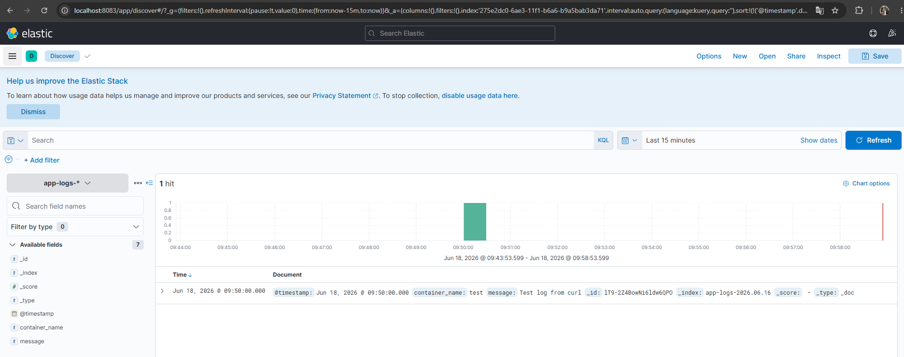
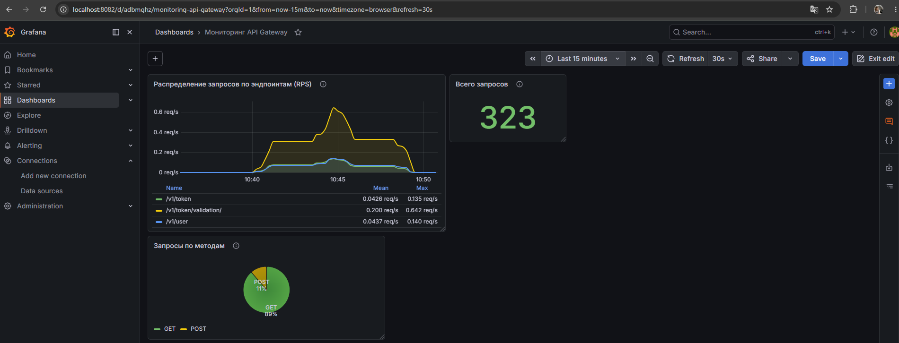
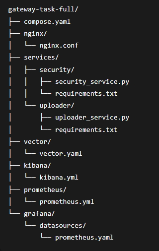

# Домашнее задание: Микросервисы: подходы

---

## Задача 1: Обеспечить разработку

### Предлагаемое решение: **GitLab Self-Hosted**

GitLab — это единая платформа, которая закрывает **все требования** из задания, не требуя интеграции нескольких разнородных продуктов. Это снижает сложность поддержки и ускоряет внедрение.

### Соответствие требованиям

| Требование | Реализация в GitLab |
|------------|---------------------|
| Облачная система | Развёртывание в любом облаке (AWS, GCP, Azure, Yandex Cloud) или использование GitLab.com (SaaS) |
| Система контроля версий Git | Встроенный Git-репозиторий с поддержкой всех операций (clone, push, pull, branch, merge) |
| Репозиторий на каждый сервис | Каждый микросервис имеет отдельный проект/репозиторий с собственным кодом и историей |
| Запуск сборки по событию из системы контроля версий | Поддержка событий: push в ветку, merge request, создание тега, расписание (schedule) |
| Запуск сборки по кнопке с указанием параметров | Ручной запуск через UI с возможностью передачи произвольных переменных (Run Pipeline → Variables) |
| Возможность привязать настройки к каждой сборке | Переменные уровня: pipeline, job, group, project; маскирование секретов в логах |
| Возможность создания шаблонов для различных конфигураций сборок | `include: local`, `include: remote`, `include: template` — переиспользование .gitlab-ci.yml |
| Возможность безопасного хранения секретных данных | CI/CD Variables с шифрованием, маскированием в логах, защита для protected веток |
| Несколько конфигураций для сборки из одного репозитория | `rules`, `only/except`, `parallel: matrix` — разные пайплайны для разных веток/окружений |
| Кастомные шаги при сборке | `before_script`, `script`, `after_script` — выполнение любых команд (bash, PowerShell, любые скрипты) |
| Собственные Docker-образы для сборки проектов | `image: my-custom-builder:latest` — использование любых образов из Container Registry |
| Возможность развернуть агентов сборки на собственных серверах | GitLab Runners: установка на Linux, Windows, macOS, Kubernetes; возможность подключения к любому кластеру |
| Возможность параллельного запуска нескольких сборок | Несколько раннеров + параллельные job'ы в одном пайплайне |
| Возможность параллельного запуска тестов | `parallel: matrix` для распараллеливания тестов, `split tests` по набору файлов |

### Взаимодействие компонентов
Разработчик → push в Git → GitLab CI/CD детектирует событие →
Запускается пайплайн на GitLab Runner (агент сборки) →
Сборка → Тесты → Сборка Docker-образа →
Пуш в Container Registry → Деплой через environment

| Почему GitLab | Почему НЕ другие |
|---------------|------------------|
| **Единая платформа** — Git, CI/CD, Container Registry, Package Registry — всё в одном продукте, не нужно интегрировать разные системы и настраивать единую авторизацию | **GitHub Actions** — требует отдельных интеграций с GitHub Packages и внешним Container Registry, сложнее администрировать |
| **Декларативный подход** — вся конфигурация в `.gitlab-ci.yml`, пайплайны хранятся вместе с кодом (GitOps) | **Jenkins** — сложность поддержки плагинов, пайплайны на Groovy, нет встроенного Git и Container Registry |
| **Масштабирование** — легко добавлять раннеры (агенты сборки) под новые сервисы, горизонтальное масштабирование | **TeamCity + Bitbucket** — две разные системы, сложная интеграция и управление правами |
| **Безопасность** — встроенное управление секретами (маскирование в логах, защита для protected веток) | **Jenkins** — управление секретами требует плагинов и дополнительной настройки |
| **Self-Hosted** — полный контроль над данными, развёртывание в любом облаке или on-premise | **GitLab.com (SaaS)** — данные хранятся у провайдера, нет полного контроля |

---

## Задача 2: Логи

### Предлагаемое решение: **Elasticsearch + Kibana + Vector**

### Соответствие требованиям

| Требование | Реализация в решении |
|------------|----------------------|
| Сбор логов в центральное хранилище со всех хостов, обслуживающих систему | Vector собирает логи со всех хостов/контейнеров и отправляет в Elasticsearch |
| Минимальные требования к приложениям, сбор логов из stdout | Приложения пишут логи в stdout (стандартный подход в контейнерах) — никаких дополнительных библиотек |
| Гарантированная доставка логов до центрального хранилища | Vector использует буферизацию (на диске или в памяти) и подтверждения доставки (ACK) |
| Обеспечение поиска и фильтрации по записям логов | Elasticsearch — полнотекстовый поиск с фильтрацией по любым полям (время, сервис, уровень, текст) |
| Обеспечение пользовательского интерфейса с возможностью предоставления доступа разработчикам для поиска по записям логов | Kibana — веб-интерфейс с ролевой моделью (разработчики получают доступ только на чтение) |
| Возможность дать ссылку на сохранённый поиск по записям логов | Kibana позволяет сохранять запросы и копировать ссылки на них для передачи коллегам |

### Взаимодействие компонентов
Сервисы (stdout) → Vector (сбор, буферизация, трансформация) →
Elasticsearch (индексация и хранение) → Kibana (UI для поиска и дашбордов) →
Разработчики (доступ через веб-интерфейс)

| Почему ELK + Vector | Почему НЕ другие |
|----------------------|------------------|
| **Гарантированная доставка** — Vector имеет встроенную буферизацию (на диске или в памяти) и подтверждения доставки (ACK), что исключает потерю логов | **Fluentd** — сложнее в настройке, ниже производительность, требует больше ресурсов для буферизации |
| **Минимальные требования** — приложения просто пишут логи в stdout, не требуя дополнительных библиотек или агентов внутри контейнера | **Splunk / Datadog** — требуют установки тяжелых агентов на каждый хост, платная лицензия, vendor lock-in |
| **Мощный поиск и фильтрация** — Elasticsearch предоставляет полнотекстовый поиск и фильтрацию по любым полям, что критично при отладке микросервисов | **Loki** — ограниченная фильтрация, сложнее в работе с большими объемами логов, нет полнотекстового поиска |
| **Гибкий UI для разработчиков** — Kibana с ролевой моделью позволяет дать доступ только на чтение, сохранять поиски и делиться ссылками | **Grafana + Loki** — интерфейс для логов менее удобен, чем Kibana, сложнее в настройке алертов по логам |
| **Open Source** — полностью бесплатное решение без ограничений по объему или количеству хостов | **Splunk / Datadog** — стоимость растет линейно с объемом логов, быстро становится экономически невыгодно |
| **Сбор из stdout** — Vector забирает логи из stdout через Docker API, не требуя изменений в коде сервисов | **Filebeat** — требует настройки парсинга путей к логам на хосте, сложнее в контейнерной среде |
| **Горизонтальное масштабирование** — Elasticsearch легко масштабируется кластеризацией под любой объем данных | **Elasticsearch + Logstash** — Logstash тяжелее и медленнее, чем Vector, требует больше ресурсов |

---

## Задача 3: Мониторинг

### Предлагаемое решение: **Prometheus + Grafana + Node Exporter + cAdvisor**

### Соответствие требованиям

| Требование | Реализация в решении |
|------------|----------------------|
| Сбор метрик со всех хостов, обслуживающих систему | Node Exporter на каждом хосте собирает системные метрики, Prometheus забирает их по расписанию (Pull) |
| Сбор метрик состояния ресурсов хостов: CPU, RAM, HDD, Network | Node Exporter предоставляет все метрики: CPU, RAM, Disk, Network, Load Average, Filesystem |
| Сбор метрик потребляемых ресурсов для каждого сервиса: CPU, RAM, HDD, Network | cAdvisor (или Kubelet в Kubernetes) собирает метрики каждого контейнера/сервиса |
| Сбор метрик, специфичных для каждого сервиса | Каждый сервис реализует эндпоинт `/metrics` в формате Prometheus (количество запросов, ошибки, время ответа, бизнес-метрики) |
| Пользовательский интерфейс с возможностью делать запросы и агрегировать информацию | Grafana + PromQL: язык запросов позволяет агрегировать данные (sum, avg, rate, histogram) |
| Пользовательский интерфейс с возможностью настраивать различные панели для отслеживания состояния системы | Grafana: гибкая система дашбордов с переменными, возможность создавать любые панели (графики, таблицы, heatmap, stat) |

### Взаимодействие компонентов
```bash
Хосты → Node Exporter (системные метрики)
Контейнеры → cAdvisor (метрики сервисов)
Сервисы → /metrics (специфичные метрики)
↓
Prometheus (Pull-сбор, хранение в TSDB)
↓
┌─────────────────┴─────────────────┐
↓ ↓
Alertmanager (алерты) Grafana (дашборды)
↓
Инженеры / SRE (доступ через UI)
```
## Обоснование выбора Prometheus + Grafana + Node Exporter + cAdvisor

| Почему Prometheus + Grafana | Почему НЕ другие |
|-----------------------------|------------------|
| **Pull-модель сбора** — Prometheus сам забирает метрики, не требуется устанавливать агенты на каждый сервис, проще управлять и масштабировать | **Zabbix** — использует push-модель с агентами, сложнее в настройке и поддержке, слабо масштабируется для микросервисов |
| **Service Discovery** — Prometheus автоматически обнаруживает новые сервисы через Kubernetes, Consul или DNS, не нужно вручную прописывать targets | **Zabbix** — требует ручного добавления хостов и сервисов, не подходит для динамической среды микросервисов |
| **Мощный язык запросов (PromQL)** — позволяет агрегировать, фильтровать и вычислять метрики в реальном времени, строить сложные дашборды | **AWS CloudWatch** — ограниченный язык запросов, меньше возможностей для агрегации и анализа |
| **Гибкие дашборды в Grafana** — возможность создавать любые панели (графики, таблицы, heatmap, stat) с переменными и фильтрами | **Datadog / New Relic** — готовые дашборды, но ограничены в кастомизации, сложно добавить специфичные бизнес-метрики |
| **Сбор метрик контейнеров через cAdvisor** — прозрачный сбор метрик каждого контейнера без изменения кода приложений | **Datadog** — требует установки тяжелого агента с платной лицензией на каждый хост |
| **Сбор специфичных метрик** — любой сервис может реализовать эндпоинт `/metrics` в формате Prometheus (количество заказов, ошибки, время ответа) | **Zabbix** — для кастомных метрик нужно писать сложные скрипты и пользовательские элементы данных |
| **Open Source** — полностью бесплатное решение без ограничений по количеству хостов, метрик или пользователей | **Datadog / New Relic** — стоимость растет с каждым хостом и метрикой, при росте микросервисов становится экономически невыгодно |
| **Горизонтальное масштабирование** — Prometheus поддерживает федерацию и удаленное хранение (Thanos, Cortex) для кластеров любого размера | **Zabbix** — при росте числа хостов упирается в производительность одного сервера |
| **Отсутствие vendor lock-in** — можно развернуть в любом облаке или on-premise, миграция не требует переписывания кода | **AWS CloudWatch** — полная привязка к AWS, невозможно развернуть локально или в другом облаке |


## Задача 4: Логи

#### Архитектура
Сервисы (stdout) → Vector → Elasticsearch → Kibana

text

| Компонент | Назначение | Порт |
|-----------|------------|------|
| **Vector** | Сбор логов из Docker контейнеров | `8686` |
| **Elasticsearch** | Хранение и индексация логов | `9200` |
| **Kibana** | Визуализация и поиск по логам | `8083` |

#### Принцип работы

1. Все сервисы пишут логи в **stdout** (стандартный вывод)
2. **Vector** подключается к Docker API и читает логи из всех контейнеров
3. **Vector** отправляет логи в **Elasticsearch** для индексации и хранения
4. **Kibana** предоставляет веб-интерфейс для просмотра и поиска по логам

<p align="center">
  
  <br>
</p>

## Задача 5: Мониторинг

| Компонент | Назначение | Порт |
|-----------|------------|------|
| **Prometheus** | Сбор и хранение метрик | `9090` |
| **Grafana** | Визуализация метрик | `8082` |

### Метрики сервисов

| Сервис | Эндпоинт |
|--------|----------|
| **Security** | `http://localhost:8081/metrics` |
| **Uploader** | `http://localhost:8082/metrics` |
| **MinIO** | `http://localhost:9000/minio/v2/metrics/cluster` |

### Принцип работы

1. В сервисы **security** и **uploader** добавлен эндпоинт `/metrics`, который отдаёт метрики в формате Prometheus
2. **MinIO** предоставляет метрики по адресу `/minio/v2/metrics/cluster`
3. **Prometheus** периодически опрашивает все сервисы и сохраняет метрики
4. **Grafana** подключается к Prometheus и отображает метрики в виде Dashboard

---

## Доступ к сервисам

| Сервис | URL | Логин | Пароль |
|--------|-----|-------|--------|
| **API Gateway** | `http://localhost:8080` | — | — |
| **Kibana (логи)** | `http://localhost:8083` | `admin` | `qwerty123456` |
| **Grafana (мониторинг)** | `http://localhost:8082` | `admin` | `qwerty123456` |
| **MinIO Console** | `http://localhost:9001` | `minioadmin` | `minioadmin` |
| **Prometheus** | `http://localhost:9090` | — | — |
| **Elasticsearch** | `http://localhost:9200` | — | — |

<p align="center">
  
  <br>
</p> <br>
 Структура проекта:

<br> <p align="center">
  
  <br>
</p>
